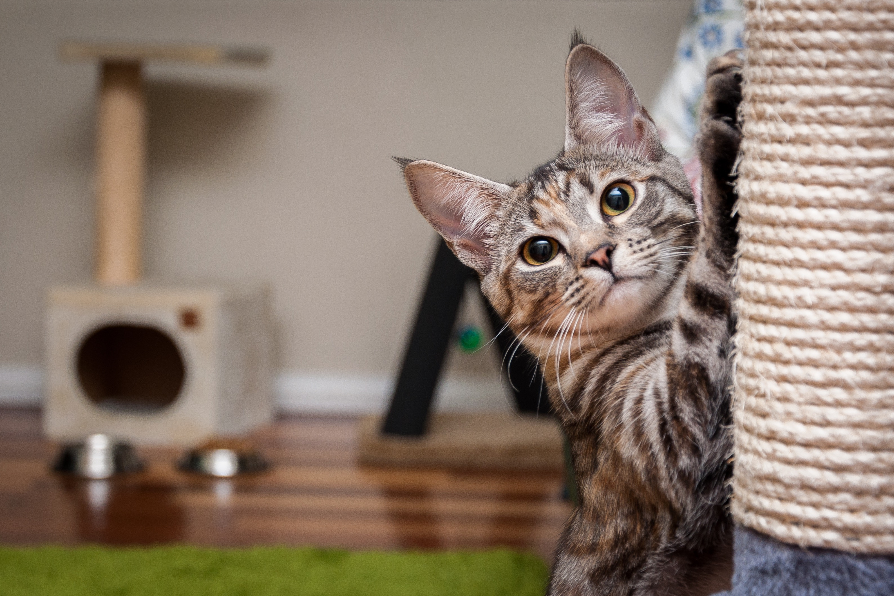

# Image tiler
The typical use case for this Node.js application is to generate tiles on different resolution levels from a given image.

## prerequisite
DOCKER :)

## Examples
`cd /into/this/project/directory`
`docker build -t tile-photo . `
`make tilePhoto imagePath=Cat.jpg tileLength=200(optional, 256 by default)`

## Problem description

Our visualiser has a feature that allows customers to view the source photos that they uploaded as part of a survey. One survey may consist of several thousand large (30+ MB) photos. To make viewing snappy, we cut each photo up into tiles. Tiles are then generated for the photo at full resolution, at 1⁄2 resolution, at 1⁄4 resolution, at 1⁄8 resolution, and so on, until the photo cannot be shrunk further (i.e. its resolution is 1 × 1). For a photo with the resolution n × m, there will be

L = 1+ ⌈log2 max(n, m)⌉

levels of tiles; each level will cover the whole photo, but on the highest (lowest-numbered) level, the original image will be shrunk down to 1 × 1 pixels. By convention the levels start at 0 and go "down" to level L − 1, which has the most number of tiles that together have as many pixels as the original photo. For the purposes of the following, assume that the tile size is 256 × 256.

How do all these little tiles help? Well, say that the photo is something like 7000 × 5000 pixels and we are viewing it in a viewport that is 1000 × 800 (0.8 megapixels). The browser can then choose to load the 4 × 3 tiles from level 10, totalling 0.8 megapixels, instead of the full photo at 35 megapixels. It also means that when zooming into different parts of the image, we only have to load higher-resolution imagery for that part, and not for any other.

Your job is to tile the photos. Some considerations:

- You may use an image library for your chosen language for image manipulation, but the level/tiling logic should be your own
- Tiles are always 256 × 256, except for the edges: if the photo is 1025 × 766, you'll end up with one-pixel slices to the right and you'll be a couple of pixels short at the bottom. That is fine.
- Your utility takes one argument, the source file, and it writes a "pyramid" of tiles to an appropriately named directory in the same directory as the source file. Name your files "L/x_y.jpg" where
    - L is the tile level (start at 0 for the most zoomed-out level),
    - x is the tile's x coordinate and
    - y is the tile's y coordinate. Coordinates start at 0,0 in the top-left corner.
- To make your setup repeatable, your code should be packaged with any dependencies in a [Docker](https://www.docker.com/) container using a Dockerfile. 

## Your solution

When evaluating your solution we'll be looking for:

- Whether your code correctly solves the problem & what tradeoffs you've made
- Well tested code, you should include automated tests
- How easy your solution is to install and deploy
- Robust error handling
- Appropriate comments in the code and a short README

That is a long list of things, and we are aware of the fact that your time is limited. Therefore, please let us know some of the tradeoffs that you have made, what you have focussed on and what you have ignored for now.

## Cat: example image

The Internet is full of cats, which is why it is important that your solution works well when tiling cat images.

